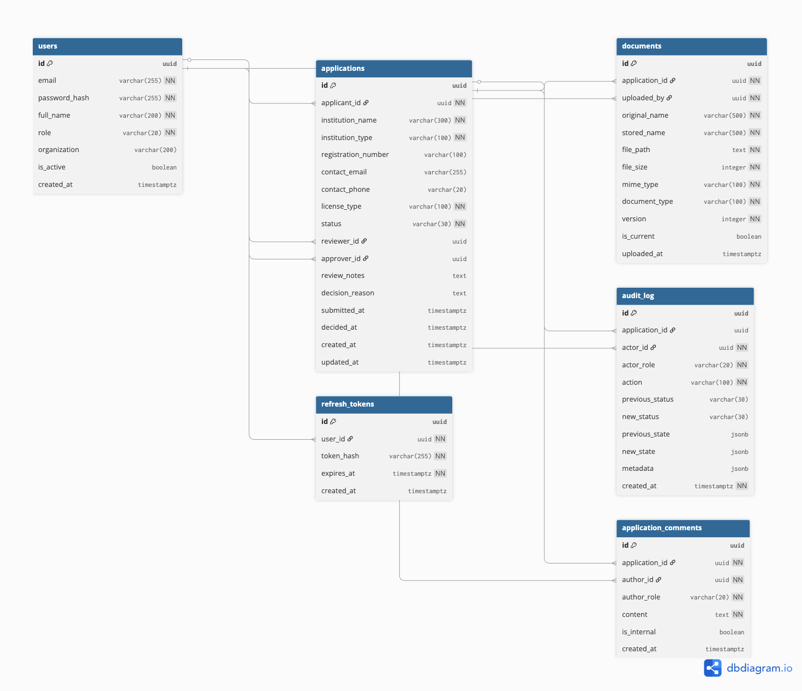

# 1. Problem Understanding

The National Bank of Rwanda (BNR), as the institution responsible for licensing and supervising every commercial bank, microfinance institution, payment service provider, forex bureau, and financial entity operating in Rwanda, currently manages bank licensing and compliance applications through a manual process involving emails, spreadsheets, and approval decisions communicated through untracked informal channels with no single source of truth.
This process creates several operational and regulatory risks, including:

- Lack of a centralized system to track applications
- No reliable audit trail for regulatory accountability
- Poor visibility into application progress and status
- Risk of unauthorized or inconsistent approval decisions
- Difficulty enforcing separation of duties between reviewers and approvers
- Increased possibility of lost documents or incomplete records
- Weak protection against concurrent modifications by multiple users

To address these challenges, this project proposes a centralized Bank Licensing & Compliance Portal that manages the entire application lifecycle from submission to final regulatory decision.

Scope: This document covers the system architecture, data model, state machine design, role definitions, security approach, and key design trade-offs for the licensing application lifecycle from initial submission through to final regulatory decision. Post-licensing compliance reporting, licensing fee management, email and SMS notifications, and document encryption at rest are identified as deliberate omissions and future phases, documented in the Hard Decisions section of this document.

# 1. Architecture

The system is built as a standard three-tier web application: a React frontend, a Node.js + Express API, and a PostgreSQL database. File uploads are stored on the local filesystem rather than a cloud service, as the challenge specifies simulated storage.
```text
┌──────────────────────────────┐
│       React Frontend         │
└──────────────┬───────────────┘
               │ HTTPS + JWT
┌──────────────▼───────────────┐
│   Node.js + Express API      │
│                              │
│  → verify JWT                │
│  → check role                │
│  → log the action            │
│  → handle the request        │
└──────┬───────────────┬───────┘
       │               │
┌──────▼──────┐  ┌─────▼──────┐
│ PostgreSQL  │  │  /uploads  │
└─────────────┘  └────────────┘
```
### Frontend

The React frontend is entirely presentation. It shows users the right interface based on their role and communicates with the API over HTTPS. It enforces nothing on its own, if someone bypasses the UI and calls the API directly, the backend still denies them.

Every request passes through three middleware steps before reaching any route handler:

Verify JWT: if the token is missing, expired, or invalid, the request stops here with a 401
Check role: if the user's role is not permitted for that route, the request stops with a 403
Log the action , the audit entry is written in the same database transaction as the action, so they always succeed or fail together

Route handlers are kept thin. Business logic lives in a service layer, not in routes.
### Database

PostgreSQL was not chosen arbitrarily. Several of its specific features map directly to the non-negotiable requirements:

SELECT FOR UPDATE handles concurrent state transitions without any extra infrastructure
REVOKE UPDATE, DELETE ON audit_log makes it physically impossible for the application to tamper with audit records — even if there is a bug
Native ENUM types enforce valid states at the database level, not just in code
JSONB columns store the before and after snapshots in each audit entry cleanly

### File Storage

Files are saved to /uploads/documents/ on the local filesystem. Each file is renamed to a UUID on upload so the original filename never touches the storage path.

### Authentication

JWT access tokens expire after 30 minutes. Refresh tokens last 7 days and are stored hashed in the database. Passwords are hashed with bcrypt and never stored in plain text.

### Why a Monolith

The system is built as a single deployable application. Regulatory systems prioritise correctness and auditability over scalability, a monolith is simpler to deploy, easier to audit, and straightforward for a small team to maintain. The entire application shares one database and one audit log, so there is no natural boundary to split on anyway. If the system grew, document handling would be the first candidate to extract as a separate service.


# 3. Roles & Permissions

The system defines four roles, each mapping to a real participant in BNR's licensing process. All permissions are enforced at the API level,not the UI.

```text
| Action                                    | APPLICANT     | REVIEWER           | APPROVER              | ADMIN |
|-------------------------------------------|---------------|--------------------|-----------------------|-------|
| Create and edit application (DRAFT only)  | Yes, own only | No                 | No                    | No    |
| Submit application                        | Yes, own only | No                 | No                    | No    |
| Upload documents                          | Yes, own only | No                 | No                    | No    |
| Resubmit documents when requested         | Yes, own only | No                 | No                    | No    |
| View own application and status           | Yes           | No                 | No                    | No    |
| View all submitted applications           | No            | Yes                | Yes                   | No    |
| Claim and start reviewing an application  | No            | Yes                | No                    | No    |
| Request additional documents              | No            | Yes, assigned only | No                    | No    |
| Complete review and add notes             | No            | Yes, assigned only | No                    | No    |
| Approve or reject application             | No            | No                 | Yes, if not reviewer  | No    |
| Manage user accounts and roles            | No            | No                 | No                    | Yes   |
| View audit log                            | No            | Yes, assigned only | Yes                   | Yes   |
| Delete or modify audit records            | No            | No                 | No                    | No    |
```

> **Important rules:**
>
> 1. The first REVIEWER to claim a SUBMITTED application becomes its assigned reviewer. 
>    Their ID is saved on the application and only they can act on it from that point.
>
> 2. The reviewer of an application cannot be the same person who approves or rejects it. 
>    The backend enforces this by comparing the approver's ID against the stored 
>    reviewer ID and returning 403 if they match.
>
> 3. No one can delete or modify audit records — including ADMIN. This is enforced 
>    at the database level, not just in application code.

# 4. State Machine & Workflow

An application moves through a defined set of states from creation to final decision. 
Every transition is validated at the API level, the status column is a PostgreSQL ENUM 
type so invalid states cannot be stored at all.

---

### States

```text
DRAFT → SUBMITTED → UNDER_REVIEW → REVIEWED → APPROVED
                         ↕                  → REJECTED
              ADDITIONAL_INFO_REQUIRED
```

| State | Description |
|-------|-------------|
| DRAFT | Created but not yet submitted. Only the applicant can see and edit it. |
| SUBMITTED | Formally submitted to BNR. Applicant can no longer edit. Waiting for a reviewer. |
| UNDER_REVIEW | A reviewer has claimed the application and is actively evaluating it. |
| ADDITIONAL_INFO_REQUIRED | Reviewer needs more documents. Applicant can upload and resubmit. |
| REVIEWED | Review complete. Waiting for an approver to make the final decision. |
| APPROVED | License granted. Permanent. No further transitions possible. |
| REJECTED | License denied. Permanent. No further transitions possible. |

---

### Valid Transitions

```text
| From                      | To                        | Who                 | Rule                                                     |
|---------------------------|---------------------------|---------------------|----------------------------------------------------------|
| DRAFT                     | SUBMITTED                 | APPLICANT (owner)   | Must have at least one document uploaded                 |
| SUBMITTED                 | UNDER_REVIEW              | REVIEWER (any)      | Sets reviewer_id via SELECT FOR UPDATE                   |
| UNDER_REVIEW              | ADDITIONAL_INFO_REQUIRED  | REVIEWER (assigned) | Must provide a reason                                    |
| ADDITIONAL_INFO_REQUIRED  | UNDER_REVIEW              | APPLICANT (owner)   | After uploading new documents                            |
| UNDER_REVIEW              | REVIEWED                  | REVIEWER (assigned) | Must add review notes                                    |
| REVIEWED                  | APPROVED                  | APPROVER            | approver_id must not match reviewer_id                   |
| REVIEWED                  | REJECTED                  | APPROVER            | approver_id must not match reviewer_id. Reason required. |
```

---

### Invalid Transitions

Any transition not listed above is rejected at the API level with a `400 Bad Request` 
response. Final states are permanent no role can reverse an APPROVED or REJECTED decision.

```text
DRAFT        → APPROVED   -- skipping the process entirely
SUBMITTED    → APPROVED   -- no review happened
UNDER_REVIEW → APPROVED   -- bypassing the REVIEWED state
APPROVED     → REJECTED   -- final decisions cannot be reversed
REJECTED     → APPROVED   -- final decisions cannot be reversed
```

---

### Concurrent Access

If two reviewers attempt to claim the same application simultaneously, the system handles 
this with `SELECT FOR UPDATE`. The first reviewer locks the row and completes the 
transition. The second reads the already updated status and receives a `400` , the 
application is no longer in SUBMITTED state.

This same pattern applies to every state transition## 4. State Machine & Workflow

An application moves through a defined set of states from creation to final decision. 
Every transition is validated at the API level ,the status column is a PostgreSQL ENUM 
type so invalid states cannot be stored at all.

# 5. Data Model

The system uses six tables. The diagram below shows all tables and their relationships.



### Key Design Decisions

- **UUID primary keys** are used throughout instead of auto-incrementing integers.
  Sequential IDs are predictable and can be enumerated by an attacker. UUIDs are not.

- **reviewer_id on applications** powers three things — the assigned only enforcement,
  the reviewer ≠ approver check, and the audit trail.

- **JSONB for audit snapshots** stores the full application state before and after
  every action — useful for compliance investigations and legal evidence.

- **No hard deletes anywhere** — applications, documents, and users are deactivated
  or versioned, never deleted. This preserves the integrity of the audit trail.

- **audit_log is append-only** — after creating the table, UPDATE and DELETE 
  permissions are revoked from the application database user at the database level.
  No code path can ever tamper with an audit record.

# 6. Hard Decisions

This section explains how each non-negotiable requirement is satisfied and what 
trade-offs were made.

### Authentication — JWT vs Sessions

JWT was chosen over session-based authentication. The system is a stateless REST API 
consumed by a React frontend, tokens carry the user's ID and role without requiring 
server-side session storage.

**Trade-off:** JWT tokens cannot be revoked before expiry. This is mitigated by the 
short access token window. In production, a token blacklist table would handle 
immediate revocation when an account is compromised.

### Reviewer ≠ Approver Enforcement

When an APPROVER attempts to approve or reject an application, the backend checks:

```javascript
if (application.reviewer_id === req.user.id) {
  return res.status(403).json({ 
    error: 'You cannot approve an application you reviewed' 
  });
}
```

This check lives in the backend service layer not the frontend. A user who bypasses 
the UI and calls the API directly will still be denied.

### Audit Trail  Tamper-Proof by Design

Every action taken on every application is recorded in the audit_log table. Each entry 
captures the acting user, their role, the action taken, and the full application state 
before and after.

The audit log is made physically tamper-proof at the database level:

```sql
REVOKE UPDATE, DELETE ON audit_log FROM app_user;
```

Audit entries are written inside the same database transaction as the action they 
record. If the action fails, the audit entry also rolls back — they are always 
consistent with each other.

### Concurrent Access SELECT FOR UPDATE

Two reviewers attempting to claim the same application simultaneously would normally 
produce a race condition. This is handled with PostgreSQL row-level locking:

```sql
BEGIN;
SELECT status, reviewer_id 
FROM applications 
WHERE id = $1 
FOR UPDATE;
-- validate transition
-- update status
-- write audit log
COMMIT;
```

The first reviewer to reach the database locks the row. The second waits, then reads 
the already-updated status and receives a `400` the application is no longer 
SUBMITTED. This applies to every state transition, not just claiming.

### Document Versioning

When an applicant resubmits documents after an additional information request, previous 
versions are never deleted. The previous document's `is_current` flag is set to `false` 
and a new row is inserted with an incremented version number. All versions remain 
accessible for the full audit trail.

File size is enforced server-side at 5MB before the file is written to disk. A file 
that exceeds the limit is rejected immediately — it never touches the filesystem.

### Illegal State Transitions

State transitions are validated in the backend service layer before any database write. 
The valid transition map is defined in code:

```javascript
const VALID_TRANSITIONS = {
  DRAFT: ['SUBMITTED'],
  SUBMITTED: ['UNDER_REVIEW'],
  UNDER_REVIEW: ['ADDITIONAL_INFO_REQUIRED', 'REVIEWED'],
  ADDITIONAL_INFO_REQUIRED: ['UNDER_REVIEW'],
  REVIEWED: ['APPROVED', 'REJECTED'],
  APPROVED: [],
  REJECTED: []
};
```

Any transition not in this map returns `400 Bad Request`. APPROVED and REJECTED have 
empty arrays — no transitions are possible from a final state, for any role.

### What I Would Do Differently Given More Time

- **Email and SMS notifications** — every state transition would trigger a notification 
  to the relevant party.

- **Document encryption at rest** — uploaded files would be encrypted 
  before being written to disk.

- **Token blacklist** — a blacklist table would allow immediate JWT revocation when 
  an account is compromised, without waiting for the token to expire naturally.

# 7. Testing Strategy

Tests cover the three areas that matter most in this system state machine correctness, 
role enforcement, and concurrent access.

### State Machine Tests

Every valid transition is tested to confirm it succeeds. Every invalid transition is 
tested to confirm it returns `400`. Terminal states are tested to confirm no further 
transitions are possible from APPROVED or REJECTED.

### Authorization Tests

Every protected route is tested with the wrong role to confirm it returns `403`. 
The reviewer ≠ approver rule is tested explicitly, an approver attempting to decide 
on an application they reviewed must be denied.

### Concurrent Access Test

Two requests attempt to claim the same SUBMITTED application simultaneously. 
The test confirms that exactly one succeeds and the other receives a `400`  
the application is claimed once and only once.

### What Would Be Added Given More Time

- Document upload tests: file size limit enforcement, versioning on resubmission
- Audit log tests : confirm every action produces an entry, confirm no entry 
  can be deleted or modified
- End-to-end tests : full application lifecycle from DRAFT to APPROVED using 
  different user accounts for each role